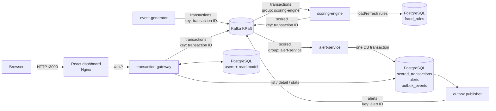

# Sentinel

Sentinel is a compact real-time fraud-detection pipeline built with Go, Kafka,
PostgreSQL and React. It accepts or generates transactions, enriches and scores
them against database-backed rules, persists decisions idempotently, creates
alerts through a transactional outbox and exposes the resulting stream in a
live risk dashboard.

The repository is intentionally a small distributed-systems project rather
than a production fraud platform. It demonstrates event contracts, partition
ordering, consumer offsets, idempotent persistence, an outbox publisher,
database migrations and a same-origin monitoring UI without introducing user
accounts or multi-tenancy that do not exist in the domain.

## What is included

- HTTP transaction ingestion and enrichment from PostgreSQL user history;
- continuous synthetic transaction generation for local demos;
- Kafka-based `transactions → scored → alerts` event flow;
- database-backed fraud rules with a periodically refreshed in-memory cache;
- partition-ordered scoring workers;
- idempotent scoring-result and alert persistence;
- transactional outbox with retry metadata and at-least-once publication;
- OpenAPI-described transaction list, detail and aggregate statistics;
- React/Vite dashboard with search, filters, score history, rule aggregates and
  event generation;
- single-node Kafka in KRaft mode with persistent metadata and log storage;
- one-command whole-pipeline smoke verification with cleanup.

## Architecture



There is currently no consumer for the `alerts` topic in this repository. The
topic is the pipeline output and integration boundary for a future notification
or case-management service.

## Services

| Component | Responsibility | Main code |
| --- | --- | --- |
| `transaction-gateway` | Validates HTTP input, loads the user, enriches the transaction, publishes it and serves the dashboard read API | `services/transaction-gateway/` |
| `scoring-engine` | Consumes transactions, evaluates cached rules and publishes scored events while preserving per-partition processing order | `services/scoring-engine/` |
| `alert-service` | Persists decisions idempotently, creates alerts and outbox records, and runs the outbox publisher | `services/alert-service/` |
| `event-generator` | Produces continuous synthetic normal, high-amount, sanctioned-jurisdiction and combined-risk scenarios | `services/event-generator/` |
| `web` | Serves the React dashboard and proxies same-origin `/api/*` requests to the gateway | `web/` |
| Kafka | Carries transaction, scoring and alert events; runs as one combined KRaft broker/controller locally | `podman-compose.yml` |
| PostgreSQL | Stores users, fraud rules, scored snapshots, alerts, outbox state and Goose migration versions | `services/*/migrations/` |

## Event flow

1. A transaction is submitted to `POST /transactions`, or the optional
   `event-generator` creates one directly.
2. `transaction-gateway` validates the HTTP request, loads the referenced user
   from PostgreSQL and builds an enriched transaction snapshot.
3. The gateway publishes the snapshot to `transactions` with the transaction
   UUID as the Kafka message key.
4. `scoring-engine` consumes `transactions` as consumer group
   `scoring-engine`. Messages from the same Kafka partition are routed to the
   same worker channel.
5. Active rules are applied in cache order. Matching `score_delta` values are
   summed and matching rule names are attached to the scored event.
6. The scored event is published to `scored`, again keyed by transaction UUID.
   The source offset is committed only after publishing succeeds.
7. `alert-service`, consumer group `alert-service`, validates and persists the
   scored event. A unique transaction constraint turns Kafka redelivery into a
   no-op.
8. Scores below `80` are stored without an alert. Alerting scores create the
   `alerts` row and the `outbox_events` row in the same PostgreSQL transaction.
9. The outbox publisher polls unpublished rows, publishes them to `alerts` with
   the alert UUID as the key, and marks successful rows as published.
10. The dashboard polls transaction and statistics endpoints every three
    seconds and renders the latest 100 processed transactions.

## Kafka contracts

| Topic | Producers | Consumer group | Message key |
| --- | --- | --- | --- |
| `transactions` | `transaction-gateway`, `event-generator` | `scoring-engine` | transaction UUID |
| `scored` | `scoring-engine` | `alert-service` | transaction UUID |
| `alerts` | alert-service outbox publisher | none in this repository | alert UUID |

Writers use `RequireAll` acknowledgements, `LeastBytes` balancing and automatic
topic creation (`pkg/kafka/writer.go`). Consumers use explicit `FetchMessage`
not used by the processing loops.

## Scoring model

Rules live in `fraud_rules` and are refreshed by `scoring-engine` every five
minutes by default. The scorer supports:

- numeric `gt` and `lt` comparisons for `amount`;
- string `eq` and `not_in` comparisons for `country` and `ip`;
- `impossible_travel`, based on a country change within a configured number of
  hours and a forward-moving transaction timestamp.

The seeded active rules are:

| Rule | Match | Score |
| --- | --- | ---: |
| `high_amount` | `amount > 50000` | `+40` |
| `sanctioned_jurisdiction` | `country == KP` | `+60` |

`North Korea (KP)` is a matched value of an individual transaction, not the
rule name used by aggregate statistics.

Alert severity is derived from the final score:

| Score | Result |
| ---: | --- |
| `< 80` | stored decision, no alert |
| `80–89` | `MEDIUM` |
| `90–119` | `HIGH` |
| `>= 120` | `CRITICAL` |

## Delivery and consistency

- Kafka ordering is relied on per partition, not globally.
- Transaction UUIDs are used as keys through `transactions` and `scored`.
- `scored_transactions.transaction_id` is unique; duplicate deliveries do not
  create duplicate decisions or alerts.
- Decision, alert and outbox insertion share one PostgreSQL transaction.
- `(topic, event_key)` is unique in `outbox_events`.
- Outbox rows are claimed with `FOR UPDATE SKIP LOCKED`, allowing multiple
  publisher instances to drain independently.
- Outbox publication is at-least-once, not exactly-once. If Kafka accepts a
  message but the publisher cannot persist `published_at`, the alert can be
  published again. Downstream consumers must deduplicate by alert ID.
- Invalid Kafka payloads are logged and committed; there is currently no DLQ.
- Processing and persistence failures retry once per second until success or
  shutdown. Failed outbox publishes record an attempt, error and next attempt
  time.

## HTTP API

The OpenAPI source is
`services/transaction-gateway/internal/api/api.swagger.yaml`. The web container
exposes the same routes under `/api`.

| Method | Direct gateway | Through web | Purpose |
| --- | --- | --- | --- |
| `POST` | `/transactions` | `/api/transactions` | accept a transaction; returns `202` and its UUID |
| `GET` | `/transactions` | `/api/transactions` | list processed transactions with pagination and optional `severity`/`min_score` filters |
| `GET` | `/transactions/{id}` | `/api/transactions/{id}` | return one processed transaction, snapshot, rules, alert and delivery state |
| `GET` | `/stats` | `/api/stats` | return processed/alert counts, average score, severity counts and top rule names |
| `GET` | `/health` | `/api/health` | gateway process health |

List pagination accepts `limit=1..100` and `offset>=0`. The dashboard requests
the latest 100 rows, applies its time-range/search/display filters client-side
and polls the list and stats endpoints every three seconds.

## Run locally

### Requirements

- Go 1.26+;
- Podman;
- `podman-compose`;
- GNU Make;
- Node.js is only required when running the frontend outside its container.

### Start

```bash
cp .env.example .env
make up
make seed
```

Open <http://127.0.0.1:3000>.

`make up` builds the application and starts:

- Kafka `7.7.1` in single-node combined KRaft broker/controller mode;
- PostgreSQL `17`;
- all four Go services;
- the Nginx-hosted dashboard.

The event generator runs continuously with the `mixed` scenario and a two
second interval unless overridden. The development seed creates the user used
by the dashboard event form and the example request below.

```bash
curl -i http://127.0.0.1:3000/api/transactions \
  -H 'Content-Type: application/json' \
  -d '{
    "user_id": "550e8400-e29b-41d4-a716-446655440000",
    "amount": 99999.99,
    "currency": "EUR",
    "ip": "203.0.113.15",
    "country": "KP"
  }'
```

Stop containers without deleting named volumes:

```bash
make down
```

Do not use `podman-compose down -v` unless deleting PostgreSQL and Kafka data is
intentional.

### KRaft storage

Kafka metadata and log segments are stored in the `kafka_data` named volume.
`SENTINEL_KAFKA_CLUSTER_ID` initializes that volume and must not be changed
while reusing it. ZooKeeper is not used.

This combined single-node topology is for local development and demonstration:
it has no broker or controller redundancy. A production cluster should use
multiple brokers/controllers, replicated topics, authentication, authorization
and encrypted listeners.

### Configuration

The Compose stack reads `.env`. Application containers receive database and
Kafka connection settings through `SENTINEL_*` environment variables, which
override the service TOML defaults.

| Variable | Purpose |
| --- | --- |
| `SENTINEL_DATABASE_USER` | PostgreSQL role and application user |
| `SENTINEL_DATABASE_PASSWORD` | PostgreSQL/application password |
| `SENTINEL_DATABASE_NAME` | shared development database |
| `SENTINEL_KAFKA_CLUSTER_ID` | KRaft cluster identity for `kafka_data` initialization |
| `SENTINEL_GENERATOR_INTERVAL` | delay between generated events; default `2s` |
| `SENTINEL_GENERATOR_SCENARIO` | `mixed`, `normal`, `high_amount`, `blocked_country` or `obvious_fraud` |

To run only infrastructure and launch services from separate terminals:

```bash
make infra-up
make run-gateway
make run-scoring
make run-alert
make run-generator
```

Local TOML defaults point to `localhost:9092` and `localhost:5432`. Compose
overrides them with `kafka:29092` and `postgres:5432`.

## Database and migrations

Each database-owning service runs Goose migrations at startup using its own
version table:

- `goose_transaction_gateway_version` — users;
- `goose_scoring_engine_version` — fraud rules and rule constraints;
- `goose_alert_service_version` — scored transactions, snapshots, alerts and
  outbox delivery state.

The services share one development database, but their migration histories are
independent. Current persistent entities are `users`, `fraud_rules`,
`scored_transactions`, `alerts` and `outbox_events`.

## Development and verification

```bash
make generate    # regenerate the Go API types/handler contract from OpenAPI
make test        # go test ./...
make test-race   # go test -race ./...
make vet         # go vet ./...
make smoke       # full running-stack test with database cleanup
```

Frontend checks:

```bash
cd web
npm ci
npm test
npm run build
```

`make smoke` requires the Compose stack. It verifies the KRaft quorum and web
health, submits a high-risk transaction through Nginx, waits for scoring, alert
creation and outbox publication, validates list/detail/stats APIs, and removes
all smoke-created database state.

## Project layout

```text
pkg/
  configs/      shared TOML/environment configuration
  database/     PostgreSQL pool and Goose helpers
  kafka/        acknowledged writer and consumer-group reader constructors
  models/       shared event and persistence models
  outbox/       transactional enqueue and outbox publisher
  storage/      generic PostgreSQL query helpers

services/
  transaction-gateway/  HTTP ingestion and dashboard read API
  scoring-engine/       rule cache, scorer and partition-routed workers
  alert-service/        decision/alert persistence and outbox publishing
  event-generator/      synthetic Kafka producer

web/                    React/Vite dashboard and Nginx reverse proxy
scripts/                development seed and whole-pipeline smoke test
podman-compose.yml      local KRaft/PostgreSQL/application topology
Makefile                build, run, generation and verification commands
```

## Current boundaries

- no authentication, authorization, accounts, profiles or workspaces;
- no consumer/UI workflow for the final `alerts` topic;
- no DLQ or bounded retry policy;
- no Kafka TLS/SASL or PostgreSQL network isolation in the local Compose file;
- no server push: the dashboard uses three-second polling;
- aggregate statistics are global, with no tenant or date-range dimension;
- single-node KRaft and replication factor `1` provide no high availability;
- rules support a small fixed set of fields and operators rather than a general
  expression language.